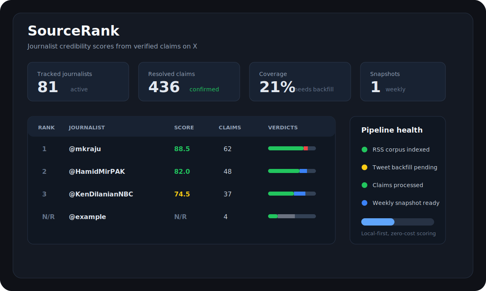
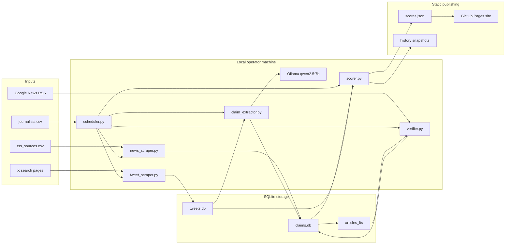
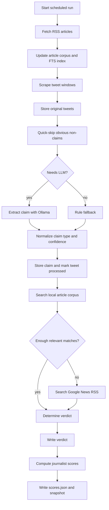
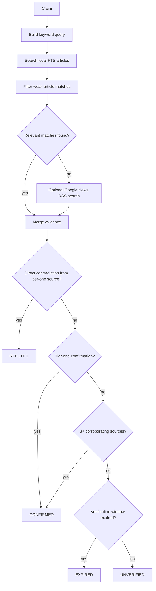
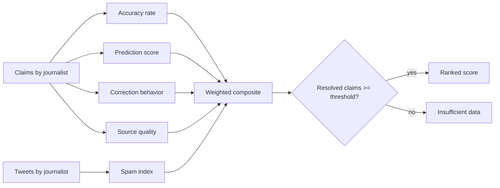
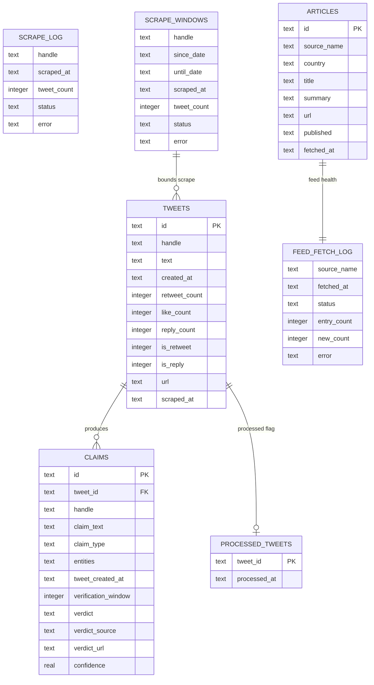
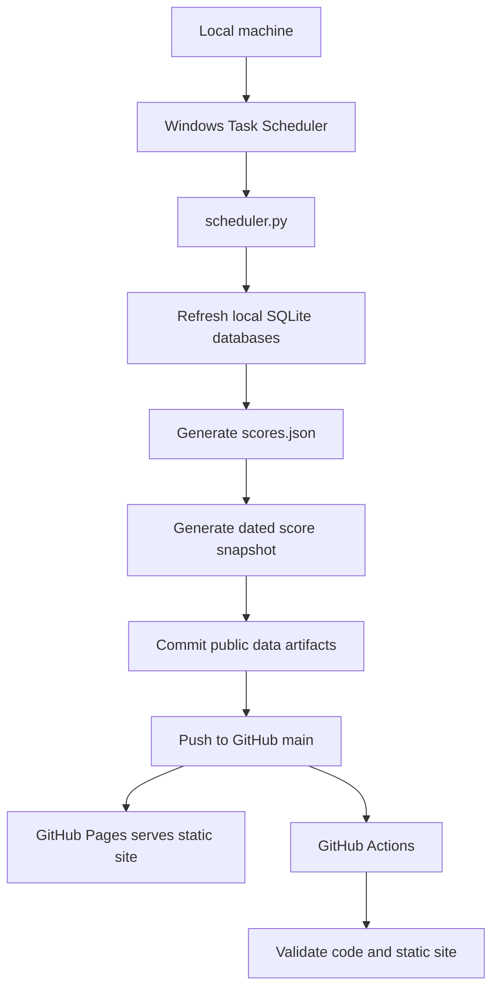
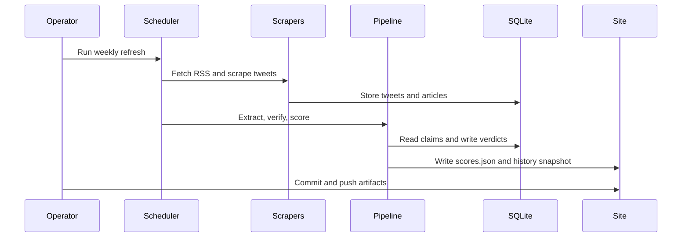

# SourceRank

**A journalist credibility scoring system for X (Twitter)**



SourceRank tracks what journalists claim on X, verifies whether those claims turned out to be true, and computes a transparent credibility score for each journalist. It is designed as a zero-cost, local-first data pipeline: no paid APIs, no cloud compute, SQLite for storage, Ollama for local LLM extraction, and GitHub Pages for publishing.

The product goal is simple: when a breaking-news tweet appears, the reader should have a data-backed signal for how much weight to give it.

---

## Portfolio Snapshot

| Area | Implementation |
|---|---|
| Product | Static credibility leaderboard for political journalists |
| Data collection | Playwright browser scraping with saved X session auth |
| Claim extraction | Local Ollama model with rule-based fallback |
| Verification | Local RSS corpus, FTS5 search, Google News RSS fallback |
| Storage | Two SQLite databases: `tweets.db` and `claims.db` |
| Publishing | `output/site/data/scores.json` consumed by a static frontend |
| Extension prototype | `extension/` Manifest V3 scaffold for future X overlays |
| Operating model | Local scheduled refreshes, GitHub Actions for static validation |
| Cost target | $0/month infrastructure |

Current local status from `scheduler.py --status --json`:

| Metric | Value |
|---|---:|
| Active journalists | 81 |
| Tweet coverage | 21.0% |
| Original tweets | 6,774 |
| Claims extracted | 616 |
| Confirmed claims | 436 |
| Ranked journalists | 9 |

---

## Problem

X is flooded with journalists, analysts, and "sources" making bold claims: breaking news, predictions, exclusives, numbers, and anonymous-source updates. There is currently no systematic way to answer:

- Did this journalist's last 10 "BREAKING" tweets actually pan out?
- How often does this person tweet unverified claims and never follow up?
- Is this account a serious reporter or a high-follower noise source?

Tools like NewsGuard or Media Bias/Fact Check rate news organizations, not individual journalists. SourceRank fills that gap with a retroactive, automated, data-driven score.

---

## How It Works

### 1. Journalist Registry

A curated CSV tracks journalists by handle, name, beat, country, follower tier, verification status, and active status.

### 2. Tweet Scraping

Tweets are scraped through Playwright using a saved browser session. The scraper stores historical windows in SQLite and supports targeted backfills for active handles with no local tweets.

### 3. Claim Extraction

Each original tweet is analyzed for checkable factual claims. The extractor uses quick rule-based filtering, local Ollama inference, confidence normalization, and a fallback extractor when Ollama is unavailable.

### 4. Verification

Extracted claims are cross-checked against a local RSS article corpus, FTS5 search, tier-one source rules, contradiction patterns, and Google News RSS fallback queries.

### 5. Scoring

Each journalist receives a composite score from accuracy, prediction quality, correction behavior, source quality, and spam index. Journalists need enough resolved claims before they are rank-eligible.

### 6. Publishing

The scorer writes `output/site/data/scores.json` plus dated snapshots under `output/site/data/history/`. The static frontend consumes those JSON files directly.

---

## System Architecture



### Architectural Decisions

| Decision | Reason |
|---|---|
| Local Playwright scraping instead of X API | Keeps cost at zero and avoids paid API limits |
| SQLite instead of hosted database | Portable, auditable, simple backup story |
| Ollama instead of hosted LLM API | Local inference, no recurring model cost |
| FTS5 article index | Fast enough for local claim matching without external search infra |
| Static JSON publishing | GitHub Pages can serve the leaderboard without a backend |

---

## Pipeline Flow



## Verification Decision Flow



## Scoring Flow



---

## Database Model

SourceRank uses two SQLite databases to keep raw tweet capture separate from derived verification data.



| Table | Database | Purpose |
|---|---|---|
| `tweets` | `tweets.db` | Raw scraped tweet records |
| `scrape_log` | `tweets.db` | Per-handle scrape run summary |
| `scrape_windows` | `tweets.db` | Monthly scrape window checkpointing |
| `claims` | `claims.db` | Extracted claims, verdicts, confidence, source links |
| `processed_tweets` | `claims.db` | Idempotency flag for claim extraction |
| `articles` | `claims.db` | RSS article corpus used for verification |
| `articles_fts` | `claims.db` | FTS5 index over article title and summary |
| `feed_fetch_log` | `claims.db` | RSS health and freshness log |

---

## Project Structure

```text
source-ranker/
|-- data/
|   |-- journalists.csv          # curated journalist registry
|   |-- rss_sources.csv          # verification news sources
|   `-- db/
|       |-- tweets.db            # scraped tweets
|       `-- claims.db            # claims, verdicts, article corpus
|-- scrapers/
|   |-- tweet_scraper.py         # Playwright-based X scraper
|   `-- news_scraper.py          # RSS article ingestion
|-- pipeline/
|   |-- claim_extractor.py       # local LLM claim extraction
|   |-- verifier.py              # claim verification engine
|   `-- scorer.py                # credibility score export
|-- scripts/
|   |-- audit_registry.py        # roster and coverage audit
|   `-- filter_arxiv_pk.py       # historical Pakistan tweet import
|-- output/site/
|   |-- index.html               # static leaderboard UI
|   `-- data/scores.json         # public data artifact
|-- extension/                   # browser overlay prototype scaffold
|-- scheduler.py                 # pipeline orchestrator
|-- config.py                    # paths, weights, source settings
`-- tests/
    `-- test_pipeline_helpers.py
```

---

## Tech Stack

| Layer | Tool | Notes |
|---|---|---|
| Tweet scraping | Playwright + saved X session | No X API cost |
| Storage | SQLite | Local, portable, easy to inspect |
| Search | SQLite FTS5 | Fast local article matching |
| Claim extraction | Ollama + `qwen2.5:7b` | Local LLM inference |
| News verification | RSS + Google News RSS | No paid API dependency |
| Scoring | Python | Transparent weighted model |
| Frontend | Static HTML + DataTables.js | No server runtime |
| Hosting | GitHub Pages | Free static publishing |
| Scheduling | Windows Task Scheduler locally | GitHub Actions only validates |

**Estimated monthly infrastructure cost: $0**

Because GitHub Actions cannot access the local X session or Ollama instance, leaderboard refreshes are generated locally. After a successful local run, commit the updated `output/site/data/scores.json` artifact so GitHub Pages serves the new leaderboard data.

---

## Local Maintenance

```bash
# Check roster balance, active duplicate people, and active handles with no local tweets
python scripts/audit_registry.py
python scripts/audit_registry.py --max-missing 10
python scripts/audit_registry.py --json
python scripts/source_coverage.py
python scripts/source_coverage.py --json

# Check local DB and leaderboard health
python scheduler.py --status
python scheduler.py --status --json
python scheduler.py --from-step extract --through-step score --dry-run

# Run the regression suite
python -m unittest discover -s tests -v

# Refresh RSS feeds; fetch health is stored in claims.db/feed_fetch_log
python scrapers/news_scraper.py
python scrapers/news_scraper.py --tier 1 --limit 5 --dry-run

# Backfill active journalists that still have no local tweets
python scripts/coverage_plan.py --limit 10
python scrapers/tweet_scraper.py --only-missing --list-selected
python scrapers/tweet_scraper.py --only-missing --limit 5 --list-selected
python scrapers/tweet_scraper.py --only-missing
python scrapers/tweet_scraper.py --only-missing --limit 5

# Process scraped tweets in bounded local LLM batches
python pipeline/claim_extractor.py --limit 500

# Review weak or unresolved claims before trusting score movement
python scripts/claim_review.py --limit 25
python scripts/claim_review.py --verdict UNVERIFIED --json

# Verify claims in bounded batches, especially when Google News is enabled
python pipeline/verifier.py --recheck --limit 100

# Refresh the public leaderboard artifact after local pipeline work
python pipeline/scorer.py
python pipeline/scorer.py --dry-run --min-resolved 5
```

---

## Operations and Deployment





### Operating Constraints

| Constraint | Implementation response |
|---|---|
| No paid APIs | RSS, Google News RSS, local browser scraping |
| No cloud inference | Ollama runs on the operator machine |
| X API unavailable | Playwright uses a saved session and search URLs |
| GitHub Actions cannot access local secrets | CI validates; local machine refreshes data |
| Long-running jobs | `--limit`, `--only-missing`, `--from-step`, `--through-step` controls |
| Small current dataset | Registry audit and targeted backfill commands expose coverage gaps |

## Portfolio Talking Points

- **Local-first architecture:** the system keeps scraping state, LLM inference, and SQLite databases on the operator machine.
- **Cost discipline:** every component was selected to avoid recurring API or hosting costs.
- **Auditable scoring:** weights, ranking thresholds, source tiers, and verdict rules live in code.
- **Resumable operations:** scrape windows, processed tweet flags, bounded extraction, and bounded verification reduce rerun risk.
- **Static publishing:** the frontend needs only JSON artifacts, so GitHub Pages is enough for deployment.
- **Evidence pipeline:** each score can be traced back from leaderboard row to claim, verdict, source, and original tweet.

---

## Scoring Methodology

| Dimension | Description | Weight |
|---|---|---:|
| Accuracy Rate | Percent of resolved claims confirmed true | 40% |
| Prediction Score | Breaking, exclusive, and prediction claim accuracy | 25% |
| Correction Behavior | Penalty for uncorrected refuted claims | 15% |
| Source Quality | Share of confirmations from tier-one sources | 10% |
| Spam Index | Penalty for high-volume original posting patterns | 10% |

The score is:

- **Transparent:** weights and source rules are visible in code.
- **Retroactive:** scoring depends on what happened after the claim.
- **Minimum-sample aware:** journalists are not ranked until they have enough resolved claims.
- **Local-first:** all private state stays on the operator machine.

---

## Roadmap

Detailed execution notes live in [`docs/PHASE_PLAN.md`](docs/PHASE_PLAN.md).

### Phase 1 - Local MVP

- [x] Project structure and schema design
- [x] Tweet scraper using Playwright session auth
- [x] SQLite schema for tweets, claims, verdicts, RSS articles
- [x] Claim extraction with local LLM and fallback rules
- [x] RSS and Google News verification engine
- [x] Minimum-sample-aware scoring
- [x] Static leaderboard site
- [x] Local maintenance and status tooling

### Phase 2 - Data Coverage

- [ ] Raise coverage from 17 active handles to 100+ journalists
- [ ] Expand historical tweet import coverage
- [x] Add RSS source depth audit by country, language, and tier
- [ ] Improve country-specific RSS source depth
- [x] Add claim review tools for false positive extraction audits

### Phase 3 - Product Surface

- [x] Journalist profile pages with claim history
- [x] Score trend page from weekly snapshots
- [x] Coverage page for dataset gaps
- [ ] Browser extension overlay with live score matching
- [x] Public methodology and dispute workflow

### Phase 4 - Browser Extension

- [x] Manifest V3 scaffold
- [x] X/Twitter content script prototype
- [x] Extension options page for custom site URL
- [x] Fetch static `scores.json` from GitHub Pages
- [x] Render inline score badges beside matching handles
- [x] Link overlay badges to SourceRank profile pages
- [x] Add hover/focus details for extension badges

---

## Disclaimer

SourceRank scores are analytical estimates based on publicly available data. They are not definitive judgments of a journalist's character or professional standing. The methodology is open and auditable. Disputed scores should be raised with supporting evidence.

---

## License

MIT
